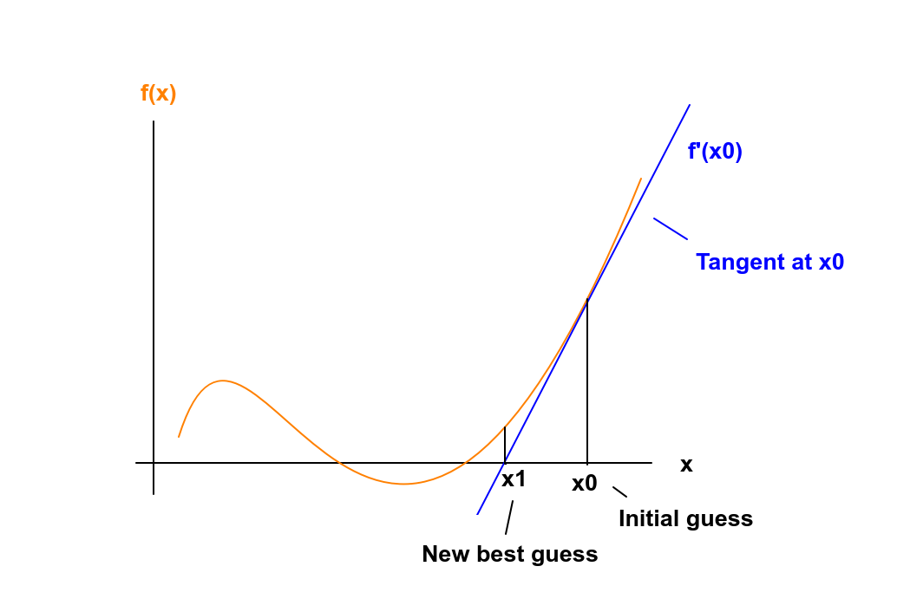

# jax_newton_optim
A brief introduction to optimizing functions with Newton's method in JAX
 
## Newton's method
 
Those of you who remember your high school's math course, may also remember Newton's method.
Newton's method is a root-finding algorithm, meaning, you input a function $f(x)$ and Newton's method will output
the $x$ value, where $f(x) = 0$.
 
The underlying idea is simple and appealing. You start off with an initial guess $x_0$, get the
tangent line to the function $f$ at $x_0$ and then calculate the intercept of the tangent with the x-axis.
You set the point of interception as your new best guess $x_1$ and iterate.
 
Graphically, the method looks like this:
 

 
As you can see, the new best guess $x_1$ is already closer to the root than $x_0$.

To make sense of this mathematically, we can make use of the Taylor expansion of a function.
The Taylor expansion of a function $f(x)$ around a point $x_i$, consists of an infinite sum of ever-increasing
derivatives of $f$.
  
$$ f(x; x_0) = f(x_0) + f'(x_0) (x - x_0) + \frac{1}{2} f''(x_0) (x-x_0)^2 + ...$$
 
We can stop this expansion after the first derivative, to get what is called the linear approximation 
of the function $f$.
 
$$ f(x; x_0) \approx f(x_0) + f'(x_0) (x - x_0) + ... $$
 
This expression is exactly the tangent to $f$ at the point $x_0$.
Since we want to get the intersection of the tangent with the x-axis, we 
can set the above expression to 0, and re-arrange:
 
$$ f(x; x_0) \approx f(x_0) + f'(x_0) (x - x_0) = 0 $$

$$ f'(x_0) (x - x_0) = -f(x_0) $$

$$ x - x_0 = -\frac{f(x_0)}{f'(x_0)} $$

$$ x = x_0 - \frac{f(x_0)}{f'(x_0)} $$
 
So there is how we can actually calculate the new best guess $x_1$.
The nice thing about Newton's method is, that if you can come up with a good guess,
then it converges quadratically (meaning, the number of accurate digits roughly doubles at 
 each iteration). Of course, there are some caveats to that; you need to come up with a good guess,
there are problems calculating the derivative for some functions, you need to handle the case of multiple
roots, etc...
Ok, so much for the setup. This repo is about optimization after all, so let's get right to it.
 
## Optimization with Newton's method
