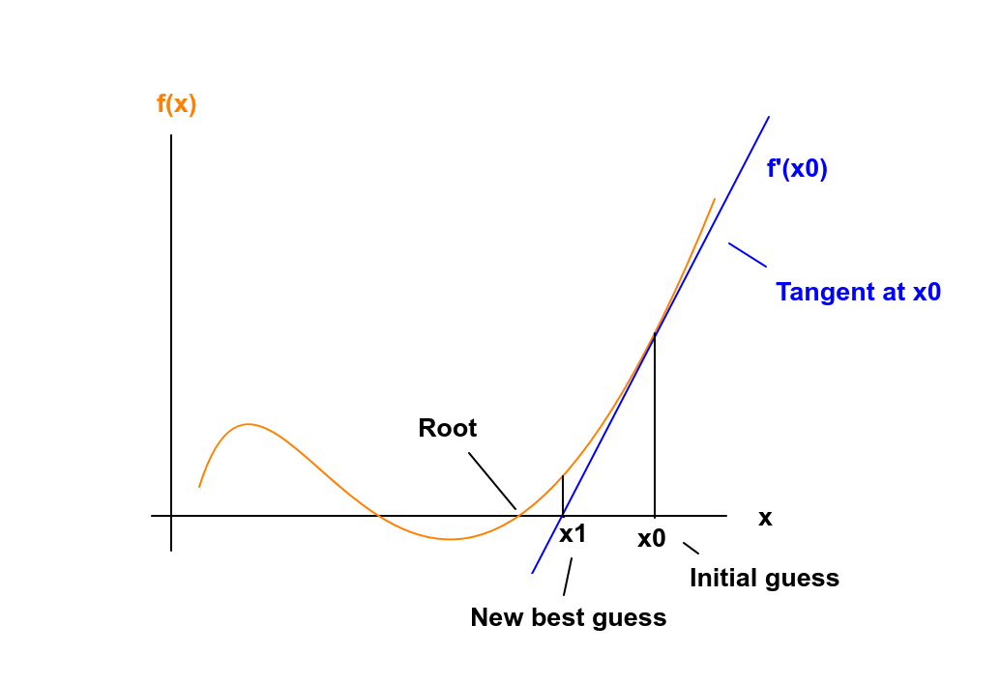

# jax_newton_optim

A brief introduction to optimizing functions with Newton's method in JAX

## Usage

Pre-requisites: poetry (see: https://python-poetry.org)

Install requirements:

    cd /path/to/git_repo
    poetry shell   # creates a virtual environment and activates it
    poetry install # installs required packages from poetry.lock

You can use **poly_optim.py** to visualize the optimization with Newton's method on a polynomial.

E.g.:

    python3 poly_optim.py --coeff 1 3 -3 2 --x-start 3 --x-range -3.5 3.5

Calling poly_optim.py with these arguments creates a polynomial of the form

$$ x^3 + 3x^2 - 3x + 2 $$

uses $x_0=3$ as the initial guess and plots the whole optimization process inside an x-range of $[-3.5, 3.5]$.

By default, plots will be created inside the **img** directory.
You can check out the optimization process in the **optimization.gif**

or use the interactive plotly plot: **optim_interactive.html**

 
## Newton's method
 
Those of you who remember your high school's math course, may also remember Newton's method.
Newton's method is a root-finding algorithm, meaning, you input a function $f(x)$ and Newton's method will output
the $x$ value, where $f(x) = 0$.
 
The underlying idea is simple and appealing. You start off with an initial guess $x_0$, get the
tangent line to the function $f$ at $x_0$ and then calculate the intercept of the tangent with the x-axis.
You set the point of interception as your new best guess $x_1$ and iterate.
 
Graphically, the method looks like this:
 

 
As you can see, the new best guess $x_1$ is already closer to the root than $x_0$.

To make sense of this mathematically, we can make use of the Taylor expansion of a function.
The Taylor expansion of a function $f(x)$ around a point $x_i$, consists of an infinite sum of ever-increasing
derivatives of $f$.
  
$$ f(x; x_0) = f(x_0) + f'(x_0) (x - x_0) + \frac{1}{2} f''(x_0) (x-x_0)^2 + ...$$
 
We can stop this expansion after the first derivative, to get what is called the linear approximation 
of the function $f$.
 
$$ f(x; x_0) \approx f(x_0) + f'(x_0) (x - x_0) + ... $$
 
This expression is exactly the tangent to $f$ at the point $x_0$.
Since we want to get the intersection of the tangent with the x-axis, we 
can set the above expression to 0, and re-arrange:
 
$$ f(x; x_0) \approx f(x_0) + f'(x_0) (x - x_0) = 0 $$

$$ f'(x_0) (x - x_0) = -f(x_0) $$

$$ x - x_0 = -\frac{f(x_0)}{f'(x_0)} $$

$$ x = x_0 - \frac{f(x_0)}{f'(x_0)} $$
 
So this is how we can actually calculate the new best guess $x_1$.
The nice thing about Newton's method is, that if you can come up with a good guess,
then it converges quadratically (meaning, the number of accurate digits roughly doubles at 
 each iteration). Of course, there are some caveats to that; you need to come up with a good guess first,
there are problems calculating the derivative for some functions, you need to handle the case of multiple
roots, etc...
Ok, so much for the setup. This repo is about optimization after all, so let's get right to it.
 
## Optimization with Newton's method

Now, how does Newton's method help us in optimization?
Optimization deals with finding those arguments $x$ of a function $f(x)$, where the function value is optimal (minimal/maximal.)
Basic calculus teaches us that a necessary condition for a point $x_0$ of a
function $f(x)$ to be an optimum, is that the first derivative of this function is zero at that point. In short:

$$ f'(x)|x_0 = 0 $$

This means, that if we can find those points $x_i$ of $f(x)$, where the first derivative is 0, then we have found an
optimum! (Note: It is not guaranteed to be an optimum. It could e.g. also be a saddle point, but we will leave that aside for now)
And Newton's method does exactly that. It finds points where a function is 0.
However, this time we are not concerned with the function $f(x)$ itself, but with its first derivative $f'(x)$!

If we follow the same approach as above and do the Taylor expansion but this time of $f'(x)$, we get:

$$ f'(x; x_0) \approx f'(x_0) + f''(x_0) (x - x_0) $$

We set this expression to 0 and re-arrange:

$$ f'(x_0) + f''(x_0) (x - x_0) = 0 $$

$$ f''(x_0) (x - x_0) = -f'(x_0) $$

$$ x - x_0 = -\frac{f'(x_0)}{f''(x_0)} $$

$$ x = x_0 - \frac{f'(x_0)}{f''(x_0)} $$

So starting from an initial guess $x_0$, we can arrive at the next best estimation by dividing the first derivative $f'(x)$
by the second derivative $f''(x)$.
And that's it! This optimization technique has all the benefits and drawbacks of Newton's method, most importantly the quadratic convergence guarantees.
If you are into Machine Learning, you have probably used gradient descent a lot (or exclusively). Gradient descent has
a linear convergence rate at best and is therefore (in theory) way slower than Newton's method.
How come Newton's method is used so seldom in Machine Learning?

One big (pun intended) drawback of Newton's method is its memory requirements.
If we look at the multivariate case, then Newton's method looks like this:

$$ \vec{x} = \vec{x}_0 - H^{-1} f(\vec{x}) \nabla f(x) $$

In this equation, the inverse of the Hessian (= matrix of second derivatives) and the gradient enter.
The Hessian of a function $f(\vec{x})$ of $n$ variables is an $n$ x $n$ - matrix.
If you think of $f$ as the loss function of a Neural Network with only 100 weights, then the Hessian would already have
100x100 = 10000 entries!!
So, while both Gradient and Newton's method use the gradient of $f$, the Hessian is what makes Newton's method so much more
computationally expensive. 
Therefore, it is not (yet) widely adopted in Machine Learning.

## Implementation

Finally, a word on actually calculating the optimum of a function with Newton's method.
In this repo, I am using JAX (https://github.com/jax-ml/jax), a library for "transforming numerical functions", that 
can be used to write very fast Machine Learning code.
Jax has plenty mathematical functions built-in, for example for calculating the Jacobian (first derivatives) and the
Hessian (second derivatives) of a function.

In **optim.py**, the function **optimize** uses exactly these two capabilities: jax.jacobian and
jax.hessian
That's basically all it does. You can check out the function, it is super simple and basically just transforms the above
formula into code.

**vis.py**  contains functions for visualizing the optimization process. It uses plotly and Pillow for that.
